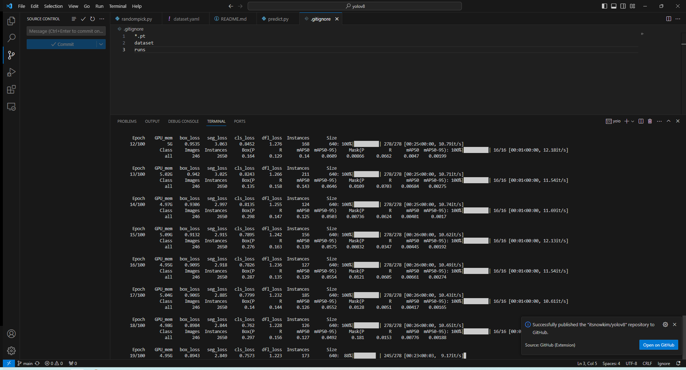

## commands
모델명
https://github.com/ultralytics/ultralytics
에서 원하는 거 찾아서 넣기

학습 command
```sh
yolo task=segment mode=train epochs=100 data=dataset/dataset.yaml model=yolov8m-seg.pt imgsz=640 batch=16
```

export command
```sh
yolo export model=runs/segment/baseline/weights/best.pt format=onnx  # export custom trained model
```

## 프로젝트 세팅 이후 첫 run

